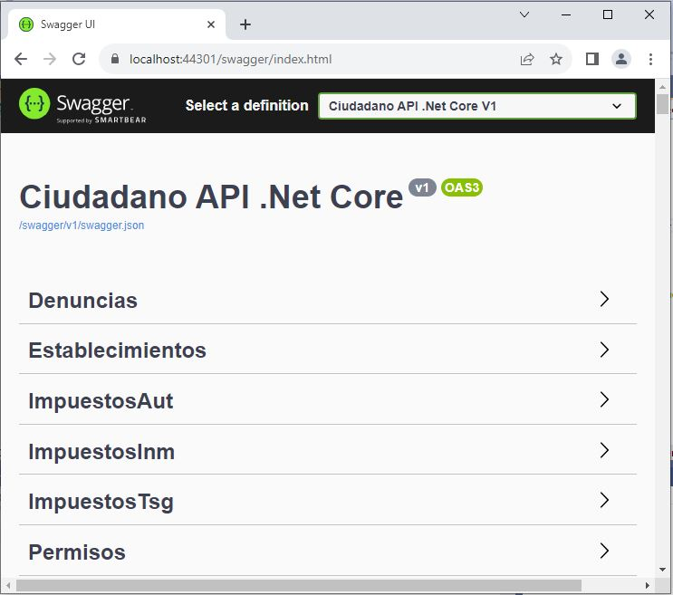

# API Rest de la Web del Ciudadano
##API Rest para la Web de Impuestos del Ciudadano desarrollada en .Net Core y Base de Datos Sql Server.

Comandos Entity Framework Core para Migraciones:

    Documentación: https://www.entityframeworktutorial.net/efcore/cli-commands-for-ef-core-migration.aspx
    Agregar migración: dotnet ef migrations add Initial
    Actualizar base de datos: dotnet ef database update
    Listar migraciones: dotnet ef migrations list
    Script de migración: dotnet ef migrations script
    Remover migración: dotnet ef migrations remove
    Eliminar base de datos: dotnet ef database drop
